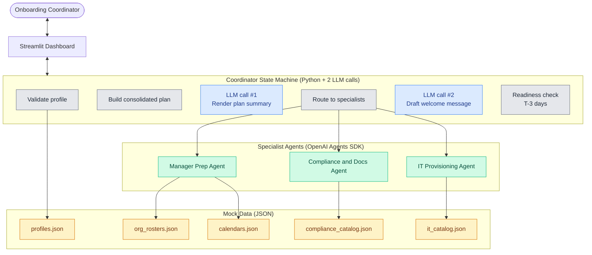
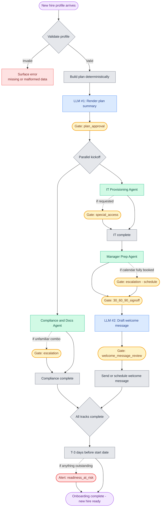
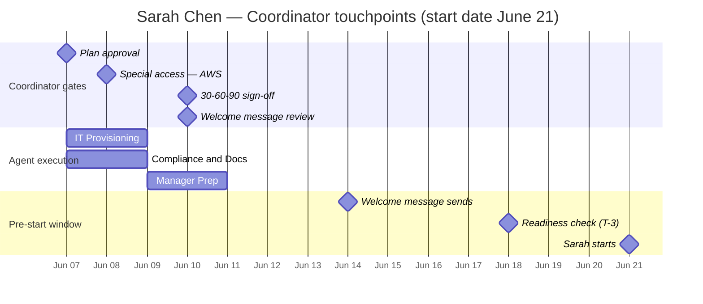

# Workflow Visualization

Three views of the same system, each useful for a different audience and demo moment.

| View | When to use it |
|------|----------------|
| **1. System architecture** | First slide — answers "what are the moving parts?" Good for the architectural-decisions narrative. |
| **2. End-to-end workflow** | Walkthrough slide — answers "how does a hire move through the system?" The detailed picture, with every HITL gate shown. |
| **3. Coordinator timeline** | Product-narrative slide — answers "what does the user actually experience?" The most persuasive view for an HR audience. |

All diagrams use Mermaid syntax. Render natively in GitHub, VS Code (Markdown Preview Mermaid extension), Obsidian, Notion, and most modern markdown viewers. For a polished slide, paste the Mermaid code into [mermaid.live](https://mermaid.live) and export to SVG or PNG.

## Color & shape legend (applies to all diagrams)

| Visual | Meaning |
|--------|---------|
| Yellow rounded box | **Decision gate** (HITL, three actions: Approve / Edit / Request changes) |
| Red rounded box | **Alert** (HITL, two actions: Acknowledge / Take action) |
| Blue box | **LLM call** (agent reasoning or content generation) |
| Gray box | **Deterministic Python** (rules, routing, validation) |
| Green box | **Specialist agent** |
| Stadium shape | Start or end of flow |

---

## 1. System architecture

The static system view. Four specialist agents, one orchestrator state machine, one dashboard, five mock data files.

**Key narrative for this view:** the orchestrator is mostly Python (gray). The agents are LLM-driven specialists (green). The orchestrator only uses the LLM for two judgment-heavy content tasks (blue). Mock data lives in JSON (yellow) — in production, these become MCP connectors to HRIS, calendar, ITSM.

---

## 2. End-to-end workflow

The sequence a single new hire (e.g., Sarah Chen) flows through, with every HITL touchpoint shown.

**Key narratives for this view:**
- Two HITL touchpoints are **guaranteed** (plan_approval, welcome_message_review). Four are **conditional**.
- IT and Compliance run in **parallel** after plan approval — visible in the fork. Manager Prep waits because the 30-60-90 references the tools IT will provision.
- Yellow = decision gates (three actions). Red = the single alert.
- Dotted arrows = conditional paths. Solid arrows = always taken.

---

## 3. Coordinator timeline

What the Onboarding Coordinator actually experiences, plotted over calendar time. This is the most persuasive view for an HR audience because it shows touchpoints as a function of *time before the new hire starts* — the dimension the coordinator thinks in.

**Key narrative for this view:**
- Total coordinator touchpoints in the happy path: **4 quick approvals**, spread across 3-4 days, asynchronously.
- Compare against today: dozens of Slack messages and emails across IT, the manager, payroll, compliance, and facilities for the *same* hire.
- The product's value proposition isn't "agents" — it's "compressed coordination time, surfaced as 4 reviewable decisions instead of 50 unreviewable messages."

---

## How to use these in the demo

| Slide | Use this diagram |
|-------|------------------|
| Opening / what I built | View 1 (Architecture) |
| How it works | View 2 (End-to-end workflow) |
| Why it matters (ROI / UX) | View 3 (Coordinator timeline) |

**Export tip:** for the interview slide deck, render each Mermaid diagram at mermaid.live and export to SVG. SVG keeps text crisp at any zoom level — important if Andrew shares his screen at a non-standard resolution.

**Edit tip:** if you change the workflow (add a gate, rename an agent), update the diagrams here *first* — they're cheaper to revise than slides, and updating the source-of-truth doc prevents drift between the spec and the demo.
